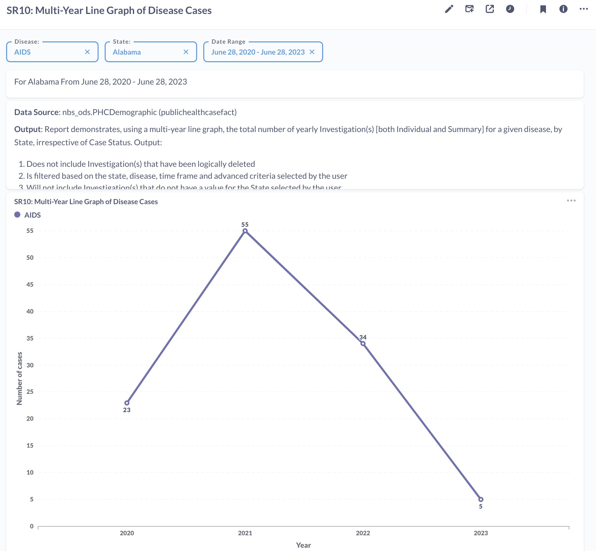

# SR10: Multi-Year Line Graph of Disease Cases

## Introduction

Standard report SR10 or Multi-Year Line Graph of Disease Cases generates a multi-year line graph of a disease given its selected state and timeframe. 

This report has been recreated on Metabase to highlight the tool's functionality, features and capabilities. The tool's features such as SQL query editor, dashboard, Variables, filters, charts are used. 

The full report can be found on [SR10: Multi-Year Line Graph of Disease Cases](https://cdc-nbs.atlassian.net/wiki/spaces/NM/pages/243171329/SR10+Multi-Year+Line+Graph+of+Disease+Cases) Confluence page. 

## Query Explanation

This query accesses the PublicHealthCaseFact table in the ODSE database. The syntax of the query is modified to suit Metabase's Variable functionality. This functionality, depicted by the text within double curly braces {{sample_text}}, provides users with placeholder to filter on specific fields. 

The filters for this report are defined in the dashboard and query. In this query, Disease_value, State_value and Date_range are variables used to filter on the disease, state and dates contained within PublicHealthCaseFact. The state filter allows a single state to be selected and the date range filter specifies the time period of the data selection. We can select one or multiple diseases. These are defined in the WHERE clause for the query. Once the filter variables are defined, we are able to view the available data plotted on a multi-year line graph.

