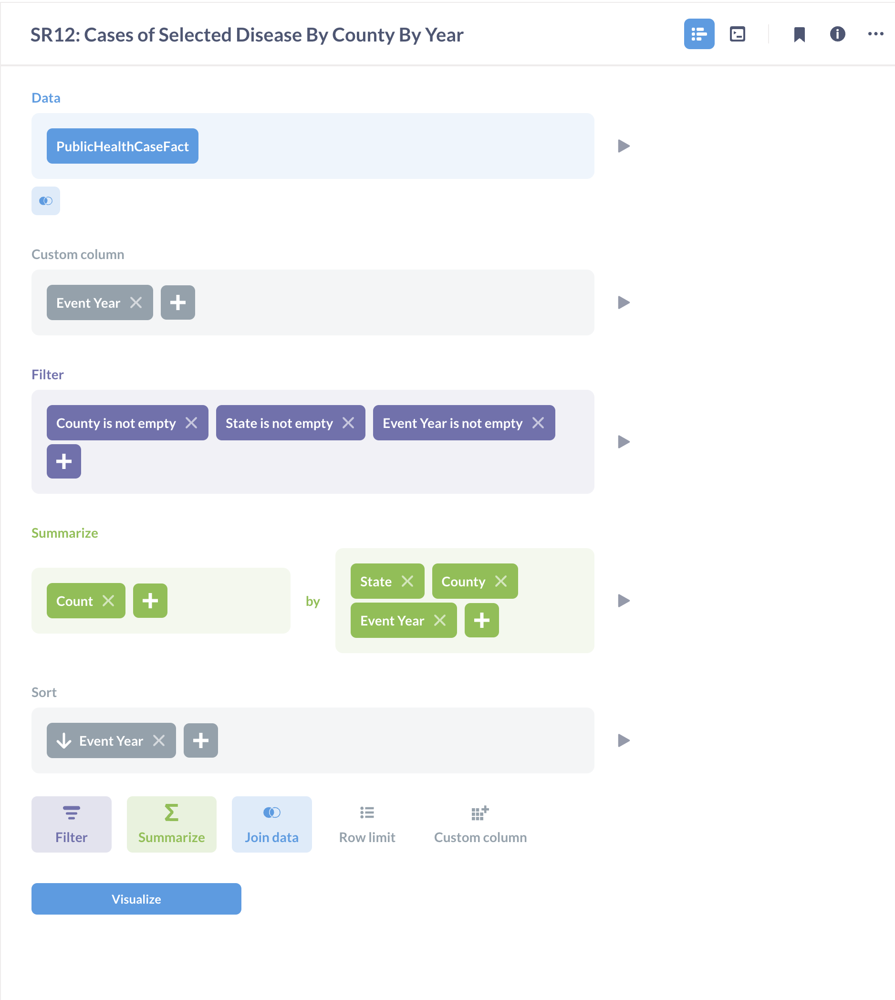
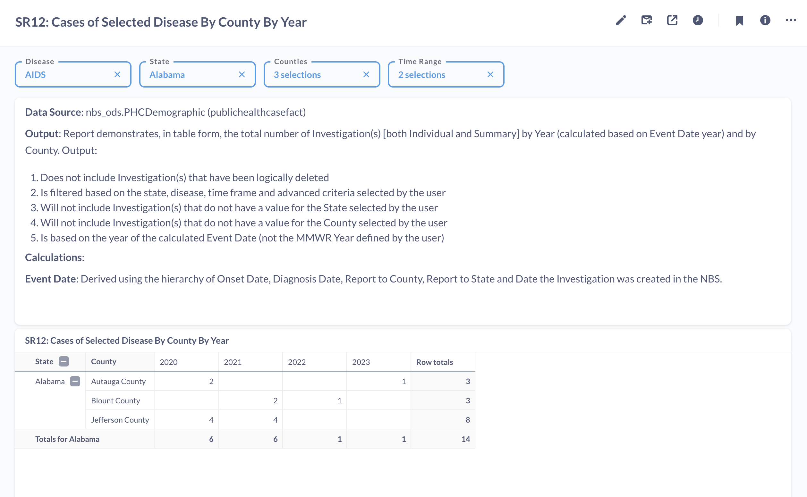

# SR12: Cases of Selected Disease By County By Year

## Introduction

Standard report SR12 or Cases of Selected Disease By County By Year: This report provides county-level breakdown of the total number of investigations for a selected state and diseases. 

This report has been recreated on Metabase to highlight the tool's functionality, features and capabilities. The tool's features such as SQL query editor, dashboard, variables, filters, charts have been used to recreate the reports. 

The full report can be found on [SR12: Cases of Selected Disease By County By Year](https://cdc-nbs.atlassian.net/wiki/spaces/NM/pages/253722635/SR12+Cases+of+Selected+Disease+By+County+By+Year) Confluence page. 
## Query Explanation

This report is built using Metabase's Query Builder feature. This feature provides a user-friendly graphical interface to interact and ask questions to the database. For SR12, PublicHealthCaseFact table in the ODSE database is used as the datasource. We can select the columns similar to SQL's select statement. We summarize the selected columns by Count and group them by State, County and Year. Empty County, State and Year information is filtered out in the Filter section. The final report created using Query Builder is added to a dashboard. The Query Builder report can be converted to a SQL query.

The filters for this report are defined in the dashboard. In this query, Disease, State, County and Time range are variables used to filter results. The state filter allows a single state to be selected and the date range filter specifies the range of years between which the data is filtered. A single or multiple diseases and counties can be selected. Once the filter variables are defined, we are able to view the available data in the pivot table. 

