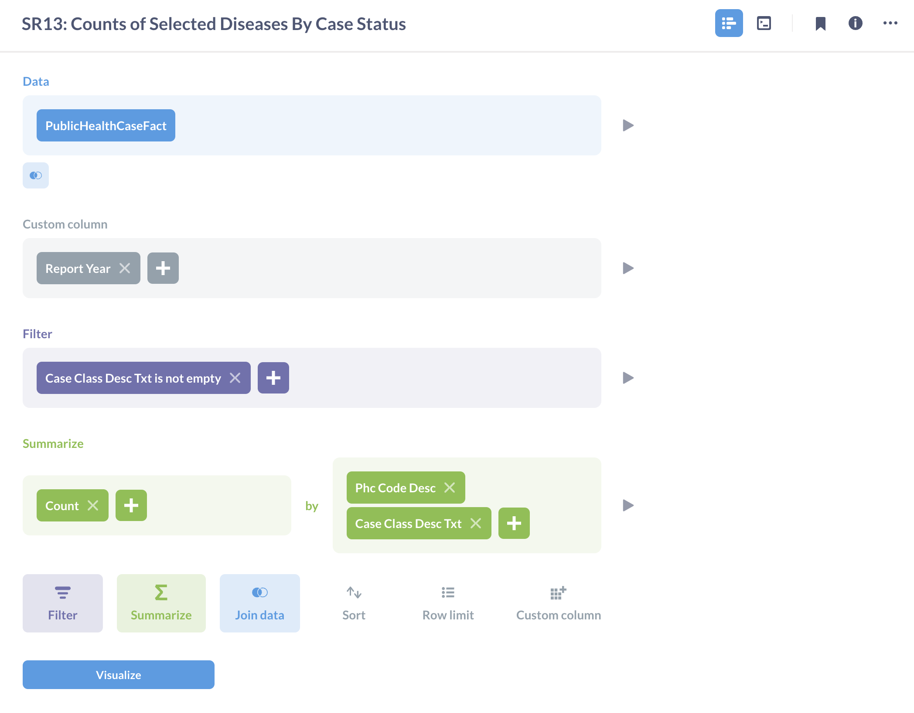
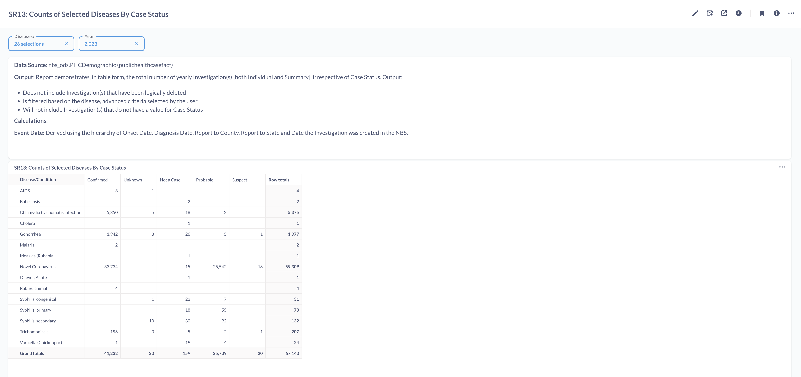

# SR13: Counts of Selected Diseases By Case Status

## Introduction

Standard report SR13 or Counts of Selected Diseases By Case Status: This report presents a pivot table that provides the breakdown of investigations by case status.

This report has been recreated on Metabase to highlight the tool's functionality, features and capabilities. The tool's features such as SQL query editor, dashboard, variables, filters, charts have been used to recreate the reports. 

The full report can be found on [SR13: Counts of Selected Diseases By Case Status](https://cdc-nbs.atlassian.net/wiki/spaces/NM/pages/132251661/SR13+Counts+of+Selected+Diseases+By+Case+Status) Confluence page. 

## Query Explanation

This report is built using Metabase's Query Builder feature. This feature provides a user-friendly graphical interface to interact and ask questions to the database. This query accesses the PublicHealthCaseFact table in the ODSE database. We can select the columns similar to SQL's select statement and create a custom columns using a field formula. The Query Builder report can be converted to a SQL query.

The filters for this report are defined in the dashboard. Disease_value and Year are variables used to filter on the disease and year values contained within PublicHealthCaseFact. The year filter specifies the time period of the data selection and we can select one or multiple diseases. Once the filter variables are defined, we are able to view the available data plotted on a pivot table.

