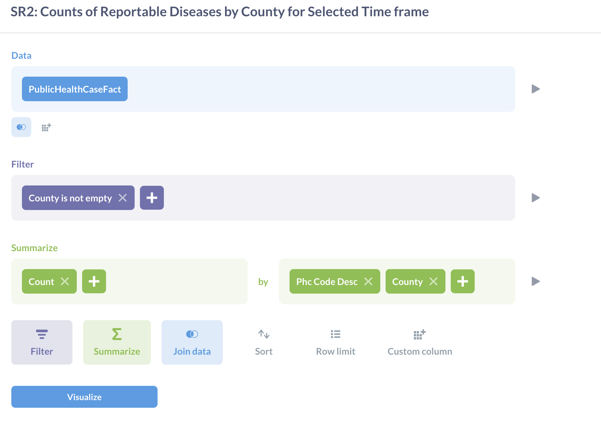
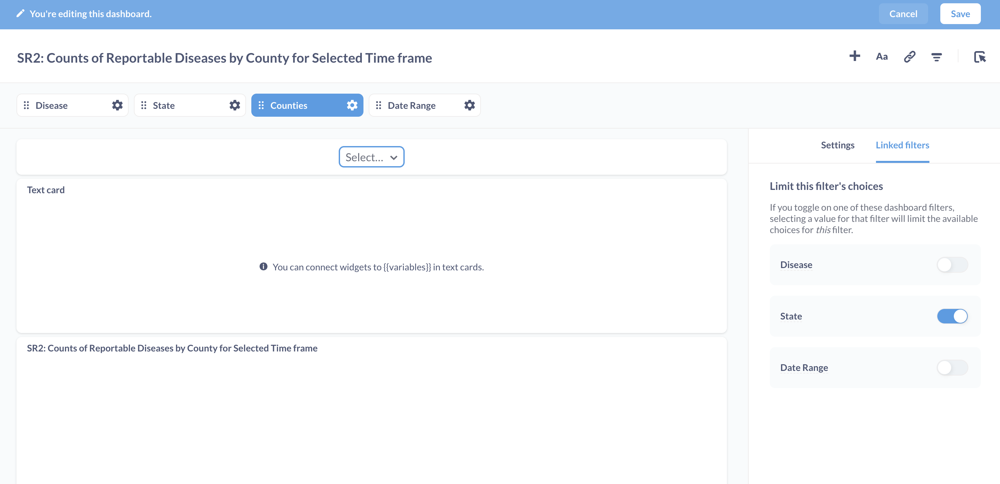
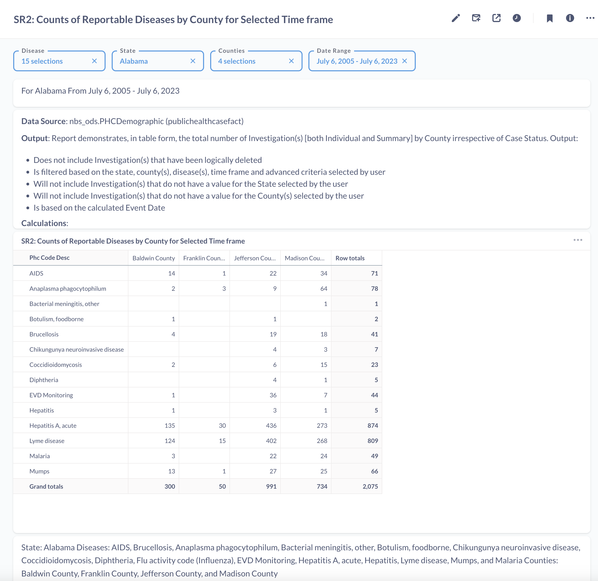

# SR2: Counts of Reportable Diseases by County for Selected Time frame

## Introduction

Standard report SR2 or Counts of Reportable Diseases by County for Selected Time frame: This report aggregates the total number of investigations for a state and provides county-level breakdown of each disease with a pivot table. 

This report has been recreated on Metabase to highlight the tool's functionality, features and capabilities. The tool's features such as SQL query editor, dashboard, variables, filters, charts have been used to recreate the reports. 

The full report can be found on [SR2: Counts of Reportable Diseases by County for Selected Time frame](https://cdc-nbs.atlassian.net/wiki/spaces/NM/pages/248938498/SR2+Counts+of+Reportable+Diseases+by+County+for+Selected+Time+frame) Confluence page. 
## Query Explanation

This report is built using Metabase's Query Builder feature. This feature provides a user-friendly graphical interface to interact and ask questions to the database. For SR2, PublicHealthCaseFact table in the ODSE database is used as the datasource. We can select the columns similar to SQL's select statement. We summarize the selected columns by Count and group them by Disease (Phc Code Desc) and County level information. Empty County information is filtered out in the Filter section. The final report created using Query Builder is added to a dashboard. The Query Builder report can be converted to a SQL query.

The filters for this report are defined in the dashboard. In this query, Disease_value, State_value, County_value and Date_range are variables used to filter on the disease, state, county and dates contained within PublicHealthCaseFact. To make sure we select counties that belong to the state selected, we can use the Linked filters to limit the choices available for the filter. 

The state filter allows a single state to be selected and the date range filter specifies the time period of the data selection. A single or multiple diseases and counties can be selected. Once the filter variables are defined, we are able to view the available data in the pivot table. 

