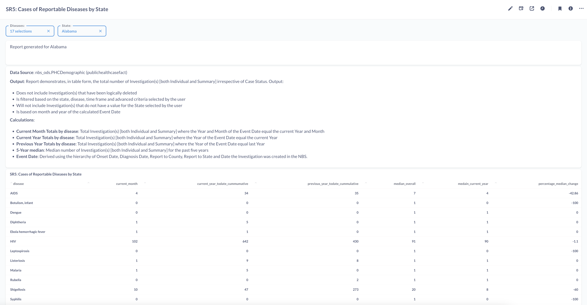

# SR5: Cases of Reportable Diseases by State

## Introduction

Standard report SR5 or Cases of Reportable Diseases by State reports the total number of investigations by state irrespective of case status. The goal of this report is to get a table that presents the cases reported in the current month, cumulative in the current year, cumulative in the past year, the 5 year median, median current year and the percentage change between the current year and 5 year median. 

This report has been recreated on Metabase to highlight the tool's functionality, features and capabilities. The tool's features such as SQL query editor, dashboard, Variables, filters, charts are used. 

The full report can be found on [SR5: Cases of Reportable Diseases by State](https://cdc-nbs.atlassian.net/wiki/spaces/NM/pages/133660834/SR5+Cases+of+Reportable+Diseases+by+State) Confluence page. 

## Query Explanation

This query accesses the PublicHealthCaseFact table in the ODSE database. The syntax of the query is modified to suit Metabase's Variable functionality. This functionality, depicted by the text within double curly braces {{sample_text}}, provides users with placeholder to filter on specific fields. 

The filters for this report are defined in the dashboard and query. In this query, Disease_value and State_value are variables used to filter on the disease and state contained within PublicHealthCaseFact. The disease filter allows selection of one or more diseases and the state filter allows a single state to be selected. These are defined in the WHERE clause for the query. Once the filter variables are defined, we are able to view the available data plotted across a table.

