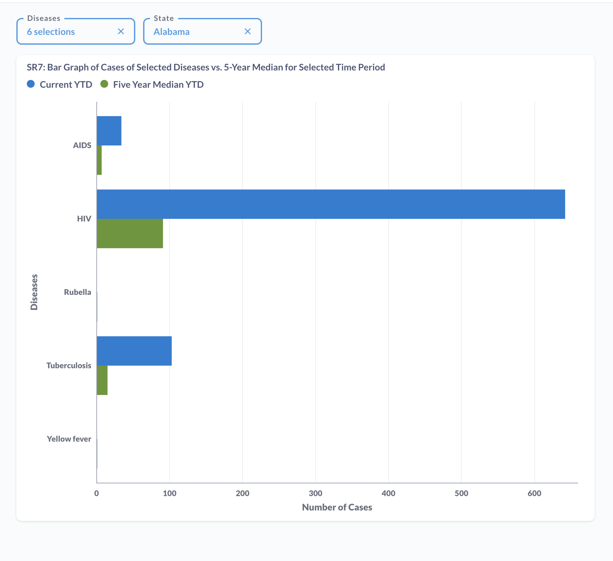

# SR7: Bar Graph of Cases of Selected Diseases vs. 5-Year Median for Selected Time Period

## Introduction

Standard report SR7 or Bar Graph of Cases of Selected Diseases vs. 5-Year Median for Selected Time Period: SR7 produces a bar graph to visualize the current year-to-date vs 5 year median year-to-date count of investigations for selected diseases in a state. 

This report has been recreated on Metabase to highlight the tool's functionality, features and capabilities. The tool's features such as SQL query editor, dashboard, variables, filters, charts have been used to recreate the reports.

The full report can be found on [SR7: Bar Graph of Cases of Selected Diseases vs. 5-Year Median for Selected Time Period](https://cdc-nbs.atlassian.net/wiki/spaces/NM/pages/253624321/SR7+Bar+Graph+of+Cases+of+Selected+Diseases+vs.+5-Year+Median+for+Selected+Time+Period) Confluence page. 

## Query Explanation

This query accesses the PublicHealthCaseFact table in the ODSE database. The syntax of the query is modified to suit Metabase's Variable functionality. This functionality, depicted by the text within double curly braces {{sample_text}}, provides users with placeholder to filter on specific fields. 

The filters for this report are defined in the dashboard and query. In this query, Disease_value and State_value are variables used to filter on the disease and state contained within PublicHealthCaseFact. The disease filter allows selection of one or more diseases and the state filter allows a single state to be selected. These are defined in the WHERE clause for the query. Once the filter variables are defined, we are able to view the available data plotted on a bar graph.

