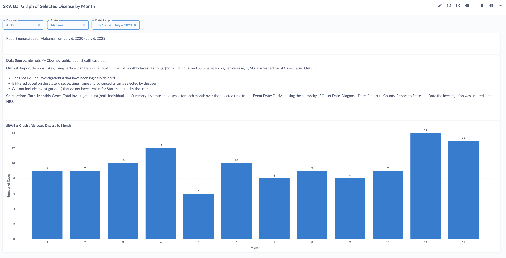

# SR9: Bar Graph of Selected Disease by Month

## Introduction

Standard report SR9 or Bar Graph of Selected Disease by Month: SR9 produces a aggregate count of cases (regardless of case status) by each month, plotted using a bar graph. 

This report has been recreated on Metabase to highlight the tool's functionality, features and capabilities. The tool's features such as SQL query editor, dashboard, variables, filters, charts have been used to recreate the reports.

The full report can be found on [SR9: Bar Graph of Selected Disease by Month](https://cdc-nbs.atlassian.net/wiki/spaces/NM/pages/251723792/SR9+Bar+Graph+of+Selected+Disease+by+Month) Confluence page. 

## Query Explanation

This query accesses the PublicHealthCaseFact table in the ODSE database. The syntax of the query is modified to suit Metabase's Variable functionality. This functionality, depicted by the text within double curly braces {{sample_text}}, provides users with placeholder to filter on specific fields. 

The filters for this report are defined in the dashboard and query. In this query, Disease_value, State_value and Date_range are variables used to filter on the disease, state and dates contained within PublicHealthCaseFact. The state filter allows a single state to be selected and the date range filter specifies the time period of the data selection. We can select one or multiple diseases. These are defined in the WHERE clause for the query. Once the filter variables are defined, we are able to view the available data plotted on a bar graph.

